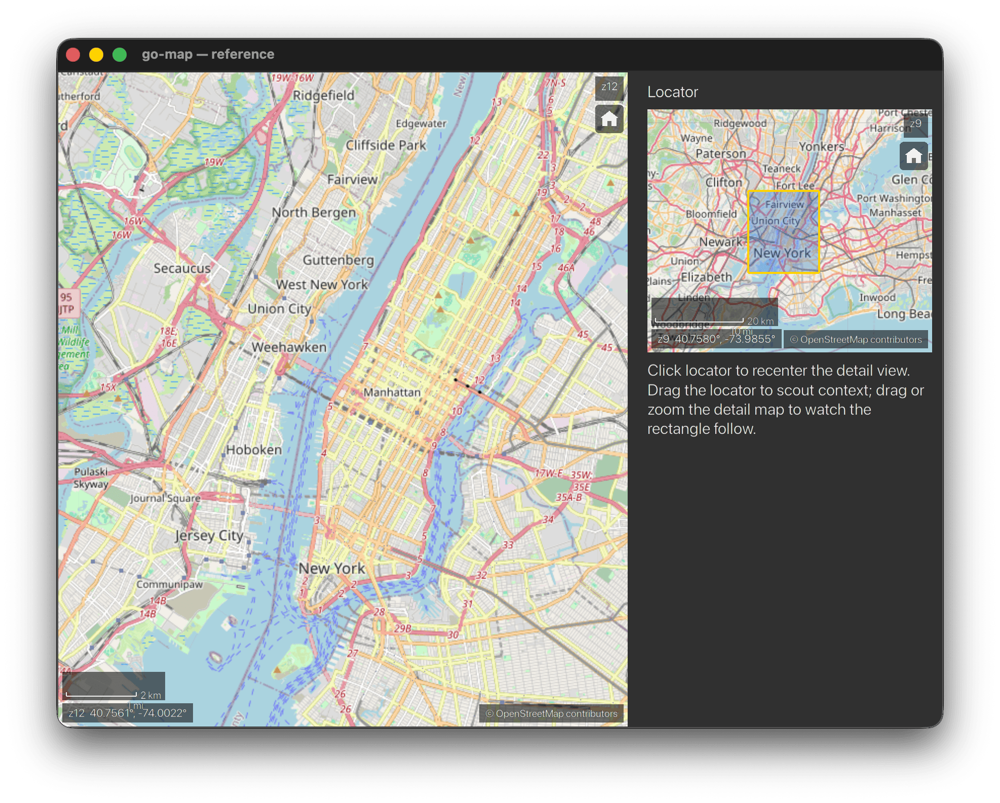

# go-map

[](https://go.dev)
[](LICENSE)

Interactive slippy-tile map widget for [go-gui](https://github.com/mike-ward/go-gui).
Raster tiles, pan/zoom, vector overlays, stacked layers.



## Features

- **Tile sources** — OSM and WMS 1.3.0 (EPSG:3857) out of the box; custom sources via the `tile.Source` interface
- **Pan and zoom** — mouse drag, scroll wheel, trackpad, keyboard; kinetic fling after drag release
- **Fractional zoom** — `ScrollZoomGain` trades wheel speed for sub-level precision
- **Overlays** — `Marker`, `Polyline`, `Polygon`, `Circle`; up to 10 000 per map, culled to viewport each frame
- **Stacked layers** — one exclusive Base plus any number of Reference layers; `AddLayer` / `RemoveLayer` / `SetBaseLayer` at runtime
- **InfoWindow** — per-Marker popup with title, body, and up to 4 action buttons; keyboard-navigable
- **HUD chrome** — scale bar, zoom level, coordinate readout, home button, attribution (non-removable per OSM policy)
- **Companion widgets** — `Legend` (layer visibility toggles), `Gallery` (base-layer switcher with thumbnails), `Overview` (locator inset with click-to-pan)
- **State API** — `PanTo`, `SetZoom`, `SetView`, `FitBounds`, `Snapshot`, `CanvasSize`
- **Callbacks** — `OnMove`, `OnZoomChange`, `OnHover`, `OnClick`, `OnPOISelect`
- **Accessibility** — ARIA labels and roles, full keyboard navigation, `a11ylint` static analyzer

## Packages

| Package         | Description                                                                             |
| --------------- | --------------------------------------------------------------------------------------- |
| `projection/`   | Web Mercator forward/inverse, `LatLng`, `Bounds`. Pure math, no deps.                   |
| `tile/`         | `TileCoord`, `Source` interface, OSM adapter with policy-compliant UA, LRU cache        |
| `tile/wms/`     | WMS 1.3.0 tile source                                                                   |
| `mapview/`      | Widget factory, pan/zoom state, overlay and layer registries, HUD and companion widgets |
| `cmd/a11ylint/` | Static analyzer: flags overlay composite literals missing a `Label` field               |

## Quick Start

```go
package main

import (
    "github.com/mike-ward/go-gui/gui"
    "github.com/mike-ward/go-gui/gui/backend"
    "github.com/mike-ward/go-map/mapview"
    "github.com/mike-ward/go-map/projection"
    "github.com/mike-ward/go-map/tile"
)

var src = tile.OSMWithUserAgent("my-app/1.0 (contact@example.com)")

func main() {
    cfg := gui.WindowCfg{
        Title:  "Map",
        Width:  900,
        Height: 650,
        OnInit: func(w *gui.Window) { w.UpdateView(view) },
    }
    if f, ok := src.(tile.HTTPFetcher); ok {
        cfg.ImageFetcher = f.HTTPFetcher()
    }
    backend.Run(gui.NewWindow(cfg))
}

func view(w *gui.Window) gui.View {
    return mapview.FullWindow(w, mapview.Map(mapview.Cfg{
        ID:            "map",
        IDFocus:       1,
        Sizing:        gui.FillFill,
        InitialCenter: projection.LatLng{Lat: 47.6062, Lng: -122.3321},
        InitialZoom:   11,
        Source:        src,
        A11YLabel:     "Seattle street map",
    }))
}
```

Run the included demo (requires SDL2):

```
go run ./examples/basic
```

## Keyboard Controls

| Key                 | Action                                           |
| ------------------- | ------------------------------------------------ |
| Arrow keys          | Pan (½ tile)                                     |
| Shift + Arrow       | Pan (1 tile)                                     |
| Ctrl + Arrow        | Pan (¼ tile)                                     |
| `+` / `=`           | Zoom in                                          |
| `-`                 | Zoom out                                         |
| `Home`              | Reset to `InitialCenter` / `InitialZoom`         |
| `Tab` / `Shift-Tab` | Cycle keyboard focus through Markers             |
| `Enter`             | Open InfoWindow on focused Marker                |
| `Escape`            | Close InfoWindow; second press exits marker mode |

## Overlays

Overlays are added and removed at runtime via `AddOverlay` / `RemoveOverlay` / `ClearOverlays`.
Each type implements the `Overlay` interface (`ID`, `Bounds`, `Draw`, `HitTest`).

```go
mapview.AddOverlay(w, "map", &mapview.Marker{
    MarkerID: "needle",
    Pos:      projection.LatLng{Lat: 47.6205, Lng: -122.3493},
    Label:    "Space Needle",       // required for accessibility
    Title:    "Space Needle",
    Body:     "Observation tower",
    Actions: []mapview.InfoWindowAction{
        {Label: "Directions", OnClick: func(w *gui.Window) { /* ... */ }},
    },
})

mapview.AddOverlay(w, "map", &mapview.Polyline{
    LineID:      "route",
    Points:      []projection.LatLng{{47.61, -122.33}, {47.65, -122.30}},
    StrokeColor: gui.Hex(0xFF6600),
    StrokeWidth: 3,
    Label:       "Route",
})

mapview.AddOverlay(w, "map", &mapview.Polygon{
    PolyID: "zone",
    Ring:   []projection.LatLng{{47.60, -122.35}, {47.63, -122.35}, {47.63, -122.30}, {47.60, -122.30}},
    Label:  "Zone",
})

mapview.AddOverlay(w, "map", &mapview.Circle{
    CircleID:     "radius",
    Center:       projection.LatLng{Lat: 47.6062, Lng: -122.3321},
    RadiusMeters: 500,
    Label:        "500m radius",
})
```

## Layers

Stack a WMS reference layer over an OSM base:

```go
import "github.com/mike-ward/go-map/tile/wms"

wmsSrc, _ := wms.New(wms.Cfg{
    Endpoint:    "https://ows.example.com/wms",
    Layers:      []string{"parcels"},
    Attribution: "© Example WMS",
    MaxZoom:     18,
    Transparent: true,
})

mapview.Map(mapview.Cfg{
    ID: "map",
    InitialLayers: []mapview.Layer{
        {LayerID: "osm",     Source: osmSrc,  Kind: mapview.LayerKindBase,      Visible: true, Name: "Streets"},
        {LayerID: "parcels", Source: wmsSrc,  Kind: mapview.LayerKindReference, Visible: true, Name: "Parcels"},
    },
    // ...
})
```

Switch the base layer at runtime:

```go
mapview.SetBaseLayer(w, "map", "satellite")
mapview.SetLayerVisible(w, "map", "parcels", false)
```

## Companion Widgets

### Legend

Renders a toggle row per named layer. Layers seeded via `Cfg.Source` (no `Name`) are skipped.

```go
mapview.Legend(mapview.LegendCfg{
    MapID: "map",
    Title: "Layers",
})
```

### Gallery

Base-layer switcher with thumbnail cards. Clicking a card calls `SetBaseLayer`.

```go
mapview.Gallery(mapview.GalleryCfg{
    MapID: "map",
    Title: "Base Maps",
    Entries: []mapview.GalleryEntry{
        {LayerID: "osm",       Label: "Streets",   ThumbnailURL: "https://..."},
        {LayerID: "satellite", Label: "Satellite", ThumbnailURL: "https://..."},
    },
})
```

### Overview

Locator inset showing the primary map's viewport as a rectangle.
Clicking the overview recenters the primary map.

```go
mapview.Overview(mapview.OverviewCfg{
    ID:            "overview",
    MapID:         "map",
    Source:        osmSrc,
    InitialCenter: projection.LatLng{Lat: 47.6062, Lng: -122.3321},
    InitialZoom:   6,
    Width:         200,
    Height:        150,
})
```

## State API

```go
mapview.PanTo(w, "map", projection.LatLng{Lat: 48.8566, Lng: 2.3522})
mapview.SetZoom(w, "map", 14)
mapview.SetView(w, "map", center, zoom)
mapview.FitBounds(w, "map", bounds, padding, canvasW, canvasH)

s, ok := mapview.Snapshot(w, "map")   // MapState{Center, Zoom, ...}
cw, ch, ok := mapview.CanvasSize(w, "map")
```

## Callbacks

```go
mapview.Map(mapview.Cfg{
    // ...
    OnMove:       func(w *gui.Window, s mapview.MapState) { /* center or zoom changed */ },
    OnZoomChange: func(w *gui.Window, zoom float64) { /* zoom only */ },
    OnHover:      func(w *gui.Window, ll projection.LatLng) { /* ~60 Hz, delta-fired */ },
    OnClick:      func(w *gui.Window, ll projection.LatLng) { /* clean click, no drag */ },
    OnPOISelect:  func(w *gui.Window, o mapview.Overlay) { /* marker hit */ },
})
```

## Accessibility

All overlay types require a non-empty `Label` field for screen readers.
The `a11ylint` analyzer catches missing labels at build time:

```
go run ./cmd/a11ylint ./...
```

## Pre-Commit Checks

```
gofmt -l .
golangci-lint run ./...
go run ./cmd/a11ylint ./...
```

## Attribution

`mapview` renders tile source attribution in the bottom-right corner on every frame.
Removing it is not supported — OSM tile usage policy requires it.

## License

MIT
